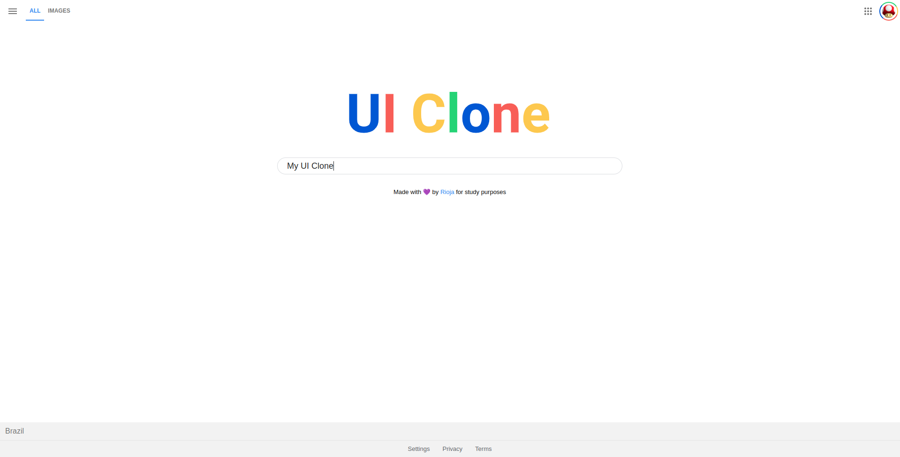

  
<h4 align="center">
UI Clone da homepage do Google 🙂
</h4>

  

  
  
  
  

 

  <a href="#sobre">Sobre</a> •
  <a href="#ui-clone">UI Clone</a> •
  <a href="#instalação">Instalação</a> •
  <a href="#tecnologias">Tecnologias</a> •
  <a href="#autor">Autor</a>  

   

## Sobre

  Projeto desenvolvido para consolidar conhecimento em media queries do CSS e padrão BEM. A aplicação foi construída seguindo <a href="https://youtu.be/KgjzE1Sxtq0?list=PL85ITvJ7FLohTZv9cC5-PrZ39Q3cugWqp" >este tutorial</a> que pertence a playlist da <strong><a href="https://rocketseat.com.br/">Rocketseat</a></strong> de clones de interfaces de sites famosos com o intuito de entender como podem ser implementados e não para fins de cópias.

 

## UI Clone

Esse projeto é um clone da página de busca do Google e tem como objetivo consolidar os conhecimentos em media queries do CSS e no padrão BEM.

Abaixo a exibição da página nos diferentes dispositivos:

  
  
Exibição da página em desktops

  

  
  
Exibição da página em dispositivos móveis

 

## Instalação

Para visualizar o resultado não é necessário instalar nenhuma ferramenta adicional, basta ter um navegador instalado. Tendo um browser instalado, basta abrir o arquivo `index.html` com ele e pronto, a página já será exibida.
 

## Tecnologias

  
  
  

 

## Autor

<h1>Luiz Rioja</h1>
<strong>Backend Developer</strong>
 
 

 
 

